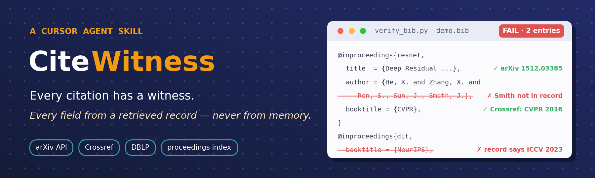

<p align="center">
  
</p>

<p align="center">
  
  
  
</p>

<h3 align="center">Your agent will happily invent a co-author. CiteWitness makes it check.</h3>

CiteWitness is a [Cursor Agent Skill](https://cursor.com) that lets an agent audit and write BibTeX references
**only from records it has actually fetched** — arXiv, Crossref, DBLP, proceedings indexes, the paper's own text.
Every field gets a source URL. Anything it cannot find, it refuses to cite.

## Why

Models remember papers the way people remember phone numbers: right shape, wrong digits. On a real 56-entry
bibliography written partly from memory, every arXiv id was real — and eight entries were still wrong:
five author lists with **people who are not on the paper**, one author order swapped, one **workshop poster cited as a
main-conference paper**, one title renamed for the proceedings, one journal version never recorded.
CiteWitness caught all of them in about a minute, with the record behind each verdict.

## What it does

- **Verify** every `.bib` entry: title, **authors surname-by-surname**, year, venue — against arXiv, Crossref and DBLP,
  optionally against a proceedings index page. Verdict `PASS` / `WARN` / `FAIL`, exit code 0 / 1 / 2.
- **Prove** an attribution: fetch the cited paper's text and grep for the sentence you lean on.
- **Write** a new entry from a fetched record only. Search results are shown as candidates; nothing is picked for you.
- **Inventory** what the `.tex` files cite: missing keys, unused entries, the context around each `\cite`.

## Install

```bash
git clone https://github.com/Mukayi/CiteWitness ~/.cursor/skills/citewitness     # personal: all projects
git clone https://github.com/Mukayi/CiteWitness .cursor/skills/citewitness       # or per project
```

Then just ask the agent — *"check the references in main.bib"*, *"is this attribution real?"*,
*"add a citation for ResNet"*, 审查引用 / 参考文献. The rules it follows are in [`SKILL.md`](SKILL.md).

## Try it

`examples/demo.bib` has five entries with planted mistakes:

```bash
python scripts/verify_bib.py examples/demo.bib
```

```text
!! FAIL resnet      - authors: names NOT in record (fabricated or misspelled): John Smith
!! FAIL dit         - venue disagrees with the record: bib says 'NeurIPS', records say ICCV
?  WARN attention   - venue 'NeurIPS' not confirmed by arXiv / Crossref / DBLP; check the proceedings index
?  WARN adam        - record shows a publication venue; the preprint entry can be upgraded (ICLR 2015)
!! FAIL ghost       - no matching record found -- treat as unverified / possibly hallucinated
```

The report ends with the corrected values, copied from the records and ready to paste
(`author = {Kaiming He and Xiangyu Zhang and Shaoqing Ren and Jian Sun}`).

Two more one-liners:

```bash
python scripts/webgrep.py --arxiv 1706.03762 "scaled dot-product attention"   # does the paper say it? 7 hit(s)
python scripts/fetch_entry.py --arxiv 1512.03385 --key resnet                  # a .bib entry from the record
```

## The rules

1. No field from memory — copied from a record with a URL, or left out.
2. A venue needs proceedings evidence; "accepted by …" in an arXiv comment is a claim. Workshop ≠ main conference.
3. Not found ⇒ not cited.
4. An attribution needs the sentence from the paper, or it is marked unverified.
5. Fixes are pastes of script output, each with a `% source:` line.

## Notes

Standard library only, https only, polite rate limits (3 s between arXiv calls). DBLP is blocked on some networks and
Crossref lacks older NeurIPS papers — the report says so instead of guessing; `webgrep.py` on the proceedings page
settles it. Details, index URLs and matching rules: [`reference.md`](reference.md).

CI: run `verify_bib.py` in a workflow and fail on exit code 2.

---

<sub>中文：CiteWitness 让 Cursor agent 只根据抓取到的记录（arXiv、Crossref、DBLP、论文集索引、论文全文）审查和撰写引用，任何字段不得来自记忆；找不到的不引，说法要有原文作证。`git clone` 到 `~/.cursor/skills/`，对 agent 说"审查一下引用"即可；`examples/demo.bib` 埋了五个错误可供试跑。</sub>
